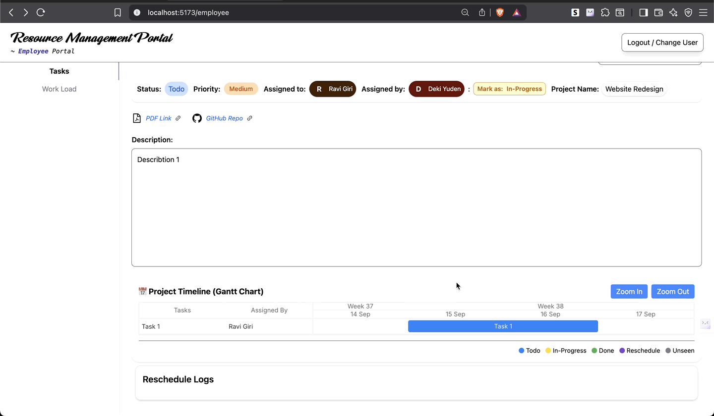
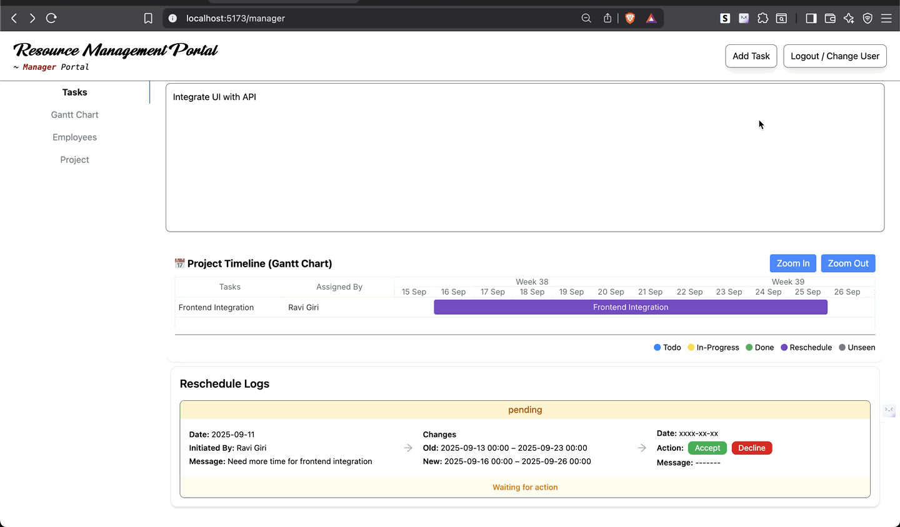
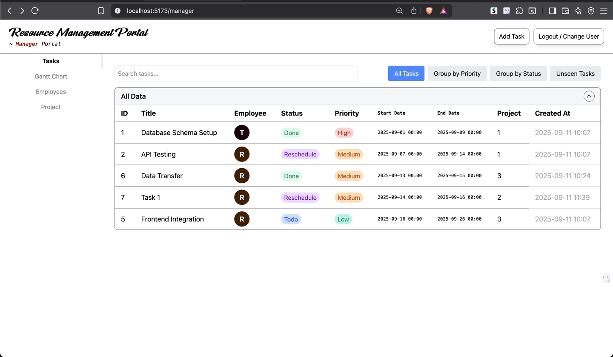

# Resource Management Portal – SELISE Assignment

 <!-- Optional: banner image -->

## Table of Contents

1. [Project Overview](#project-overview)
2. [Problem Statement](#problem-statement)
3. [Tech Stack](#tech-stack)
4. [Features](#features)
5. [Creative Additions](#creative-additions)
6. [Setup Instructions](#setup-instructions)
7. [Seed Data](#seed-data)
8. [Demo](#demo)
9. [Screenshots / GIF](#screenshots--gif)
10. [Future Improvements](#future-improvements)
11. [Repo Structure](#repo-structure)

---

## Project Overview

The **Resource Management Portal** is designed to help project managers and employees at SELISE efficiently plan, assign, and track tasks. It centralizes task management, employee workload tracking, and rescheduling processes to ensure smooth project execution.

---

## Problem Statement

- Managing resources manually is tedious due to increasing employee numbers.
- Managers often don’t know what employees are working on without enquiring.
- Different projects use different tools, causing confusion.
- Employees may struggle to prioritize tasks according to availability.

**Solution:** A unified portal that allows managers to assign tasks, track progress, visualize workloads, and manage reschedules, while enabling employees to organize their own tasks and report status updates efficiently.

---

## Tech Stack

- **Frontend:** React (Vite + TypeScript)
- **Styling:** Tailwind CSS
- **State Management:** useState + Context API
- **Backend:** Ruby on Rails API
- **Database:** PostgreSQL
- **Others:** Gantt charts, Pie charts, JSON/REST API integration

---

## Features

### For Project Manager

- **Task Creation Form** – create tasks with title, description, priority, start/end dates, PDF & GitHub links.
- **Employee Gantt Table** – view assigned tasks and availability when assigning new tasks.
- **Task List** – all tasks assigned by the manager in a clean table.
- **Employee List View** – click on an employee to see their Gantt table and pie chart analysis of task statuses.
- **Task Details & Reschedule Log** – view task specifics and all reschedule requests with approvals.

### For Employee

- **Task List** – see all assigned tasks with status and priority.
- **Workload Tab** – visualize all tasks in Gantt chart + pie chart for analysis.
- **Task Status Update** – change task status from _To Do → In Progress → Done_.
- **Reschedule Request Flow** – request a new timeline for tasks; requires manager approval before changes apply.
- **Unseen → To Do Status** – newly assigned tasks appear as _Unseen_ until opened, then auto-change to _To Do_.

---

## Creative Additions

These are **extra features** beyond the basic requirements:

- **Pie Chart Analytics:** Both managers and employees can view task completion percentage, pending tasks, and workload distribution.
- **Reschedule Log System:** Logs every reschedule request with requester, reason, old & new dates, status (pending/accepted/rejected), action by, and message.
- **Task Lock on Reschedule:** Employees cannot edit task timings once a reschedule request is pending, enforcing manager approval workflow.
- **Workload Overview:** Dedicated tab for employees to see all tasks in one place with Gantt + pie charts.
- **Dynamic Status Handling:** Unseen tasks auto-update to To Do when viewed.
- **Interactive Gantt Charts:** Drag & drop scheduling with proper validations for both managers and employees.

---

## Setup Instructions

**Backend Setup**

```bash
cd portal_api
bundle install
rails db:create
rails db:migrate
rails db:seed
rails s
```

**Frontend Setup**

```bash
cd ../portal_frontend
npm install
npm run dev
```

## Open browser: http://localhost:5173 (or the port shown by Vite)

### Prerequisites

- Ruby 3.3.0, Rails 9.0.2
- Node.js 18+
- PostgreSQL
- Yarn or npm

### Steps

1. Clone the repo:

```bash
git clone https://github.com/Ravigiri2022/selise-resource-management-portal.git
cd resource-management-portal
```

### Seed Data

- Users: 6 users (employees & managers)
- Projects: 3 projects
- Tasks: 5 tasks with varying statuses (unseen, todo, in_progress, done, rescheduled)
- Reschedule Logs: 3 logs covering pending, accepted, rejected scenarios
- Notifications: sample notifications for tasks & reschedules

---

### Demo

### Screenshots / GIF

1. **Task Creation**

   

2. **Drag & Drop Scheduling**

   

3. **Reschedule Approval**

   

4. **Task List**

   

5. **Task List**

   

6. **Statistical Data**

   

7. **User Navigation**

   

### Future Improvements

- Add login/signup system with role-based authentication
- Push real-time notifications for task updates & reschedules
- Export reports (CSV/PDF) for tasks and workload analysis
- Integrate calendar view for better planning

### Repo Structure

```bash
resource-management-portal/ # React + Tailwind frontend
│
├─ portal_api/            # Rails API backend
├─ assets/                # Images / GIFs for README
└─ README.md
```
